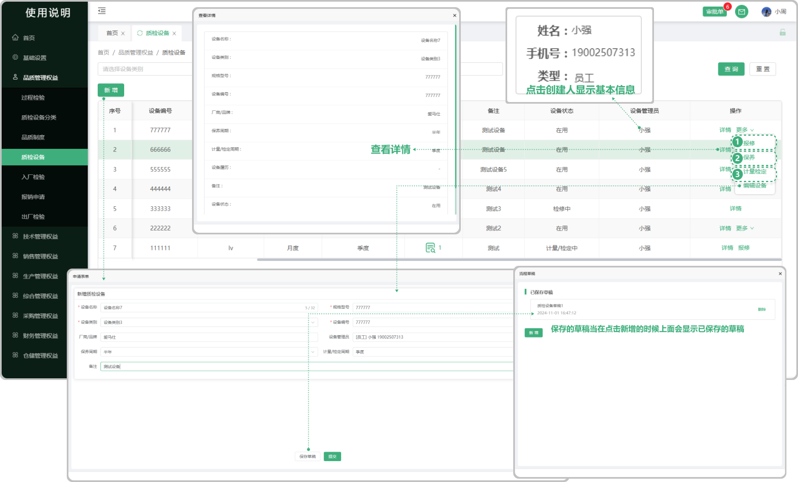
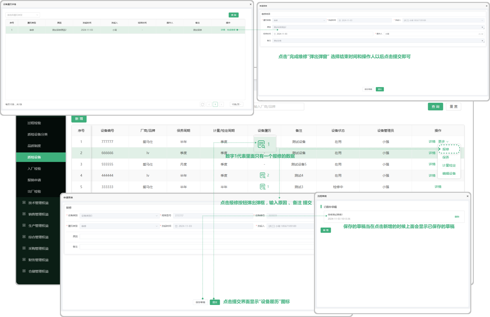
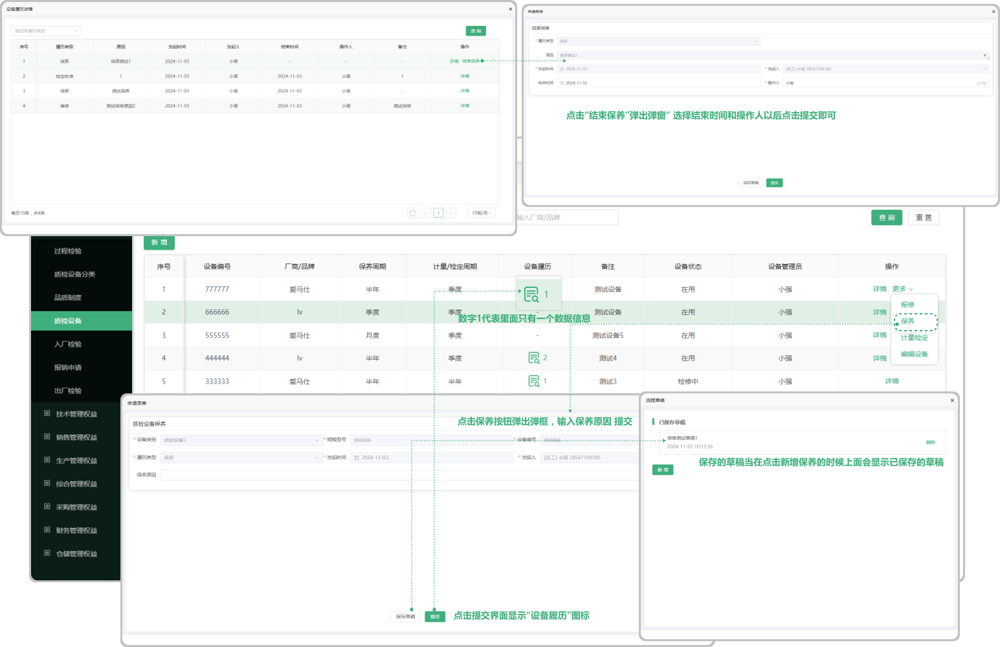

# 质检设备

> "质检设备分类"位于品质管理板块，在页面中可以新增 “质检设备” 支持编辑（点击“更多”按钮显示、报修、保养、质量检定、编辑设备、点击这些按钮跳转不同弹窗进行编辑），如果点击更多中的其中一个按钮（报修、保养、计量检定）界面显示详情，在报修、保养、计量检定中“只能”一个一个的安排，在结束任意一个的时候才能进行下一个的安排操作

 #### 1. 如图所示：质检设备

* 设备管理员：点击设备管理员下面对应人员的信息可以查看员工的基本信息资料
* 编辑设备：在界面中点击编辑设备时，跳出弹窗，可在弹窗中编辑更改之前所新增的质检设备
* 保存草稿：当在点击新增的时候什么会显示已保存的草稿

#### 2. 如图所示：报修
* 报修：在页面中点击报修可以对这个质检设备进行报修
* 设备履历：只有在添加了报修、保养、计量单位、以后才显示设备履历的图标（图标里面的数字代表了里面有多少条数据信息）
* 完成维修：点击设备履历可看到所报修的数据信息，可点击“完成维修”选择结束时间提交即可
* 保存草稿：当在点击报修的时候什么会显示已保存的草稿

#### 3. 如图所示：保养
* 保养：在页面中点击保养可以对这个质检设备进行保养
* 设备履历：只有在添加了报修、保养、计量单位、以后才显示设备履历的图标（图标里面的数字代表了里面有多少条数据信息）
* 结束保养：点击设备履历可看到所保养的数据信息，可点击“结束保养”选择结束时间提交即可
* 保存草稿：当在点击保养的时候什么会显示已保存的草稿

#### 4. 如图所示：计量检定
* 计量检定：在页面中点击计量检定可以对这个质检设备进行计量检定
* 设备履历：只有在添加了报修、保养、计量单位、以后才显示设备履历的图标（图标里面的数字代表了里面有多少条数据信息）
* 完成计量：点击设备履历可看到所计量检定的数据信息，可点击“完成计量”选择结束时间提交即可
* 保存草稿：当在点击计量检定的时候什么会显示已保存的草稿

