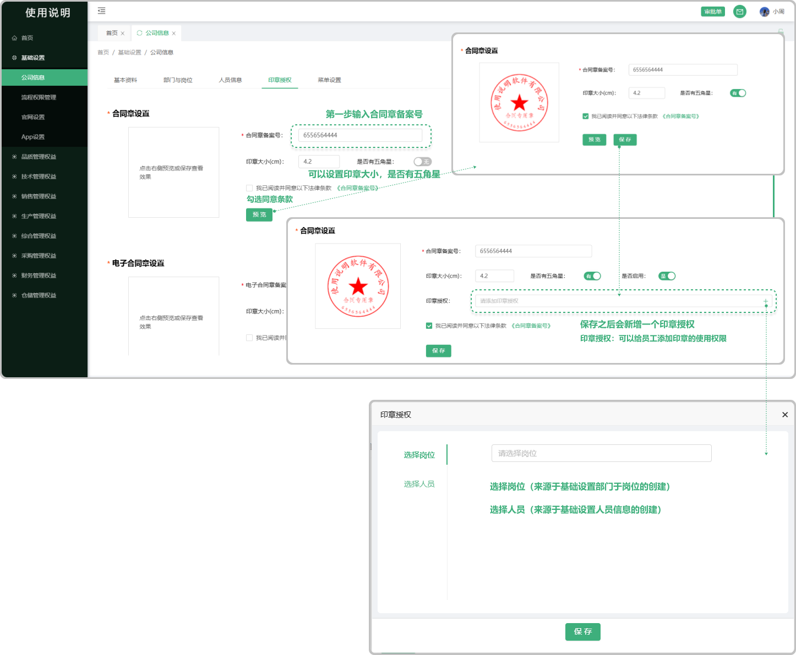
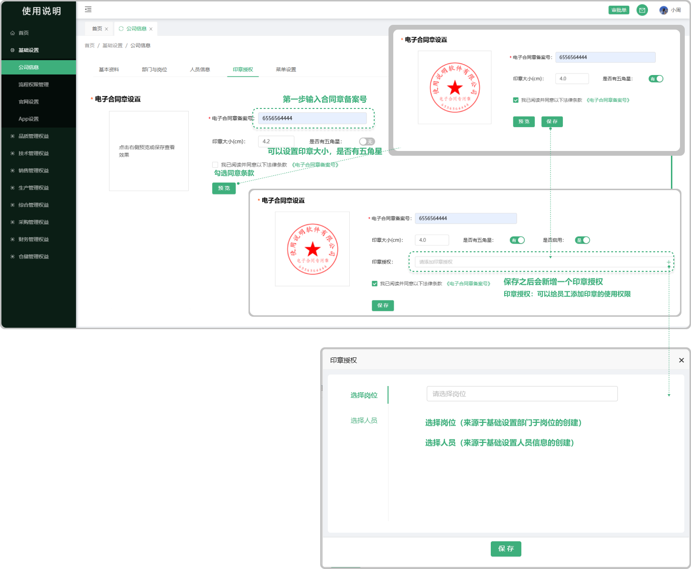
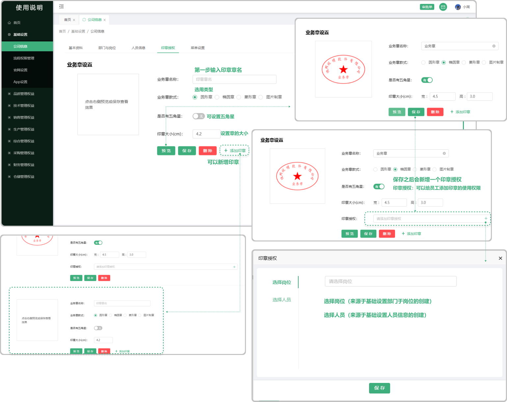

# 印章授权

> 印章授权是指授予企业员工使用某企业印章的权限，系统将分为合同章、电子合同章、业务章

#### 1. 如图所示：
* 输入合同章备案号（必填） 可以自由设置印章的大小 可选是否有五角星， 勾选同意法律条款即可预览印章 可以保存。在保存之后页面上会新增一个 “是否启用”（不启用情况下是无法使用的）会新增一个印章授权（点击添加可以选择岗位、员工的印章使用权限）

#### 2. 如图所示：
* 输入电子合同章备案号（必填） 可以自由设置印章的大小 可选是否有五角星， 勾选同意法律条款即可预览印章 可以保存。在保存之后页面上会新增一个 “是否启用”（不启用情况下是无法使用的）会新增一个印章授权（点击添加可以选择岗位、员工的印章使用权限）

#### 3. 如图所示：
* 点击新增业务章，输入业务章名称（必填）  可选圆形章、椭圆形章、菱形章、图片制章，可选是否有五角星，可以自由设置印章的大小  可点击添加多个业务章 可点击预览、可点击删除  最后保存即可

