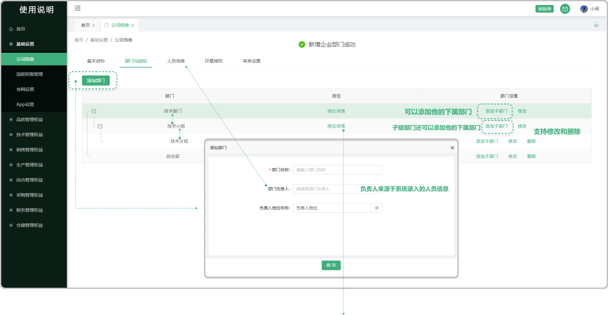

# 部门与岗位

> 部门与岗位是组织结构的两个核心组成部分，它们共同构成了组织的基本框架，确保组织能够高效、有序地运作  部门：是组织内部按照业务功能或管理职能划分的单元。每个部门都承担着特定的职责和任务，以确保组织整体目标的实现。  岗位：是组织内部为了完成特定任务而设置的工作职位。每个岗位都有明确的职责、权限和工作要求，以确保部门目标的实现。

###  一、可以新增部门，同时可以 “添加子级部门” ，在 “子级部门” 下面还可以 ”添加子级部门" 以此类推

#### 1. 如图所示： 
* 点击 添加部门

###  二、点击岗位详情跳出弹窗进行下一步的 “添加岗位”

#### 2. 如图所示：
* 点击岗位详情打开弹窗显示如下 可以 “添加岗位” 进行权益配置， （系统拟定的岗位名称可能与您企业的岗位名称不一致，请修改。）(注：置灰/加横线 属于功能升级停用) 点击文字进入岗位的信息需求选项（如果先点击勾选框时，系统将提示：选择显示字段数据）后面可以接着进行查看归属权限打开浮出权限图标，点击进入查看权限设置 （注意:设置归属查看，可通过设置项控制人员的数据查看范围。)

