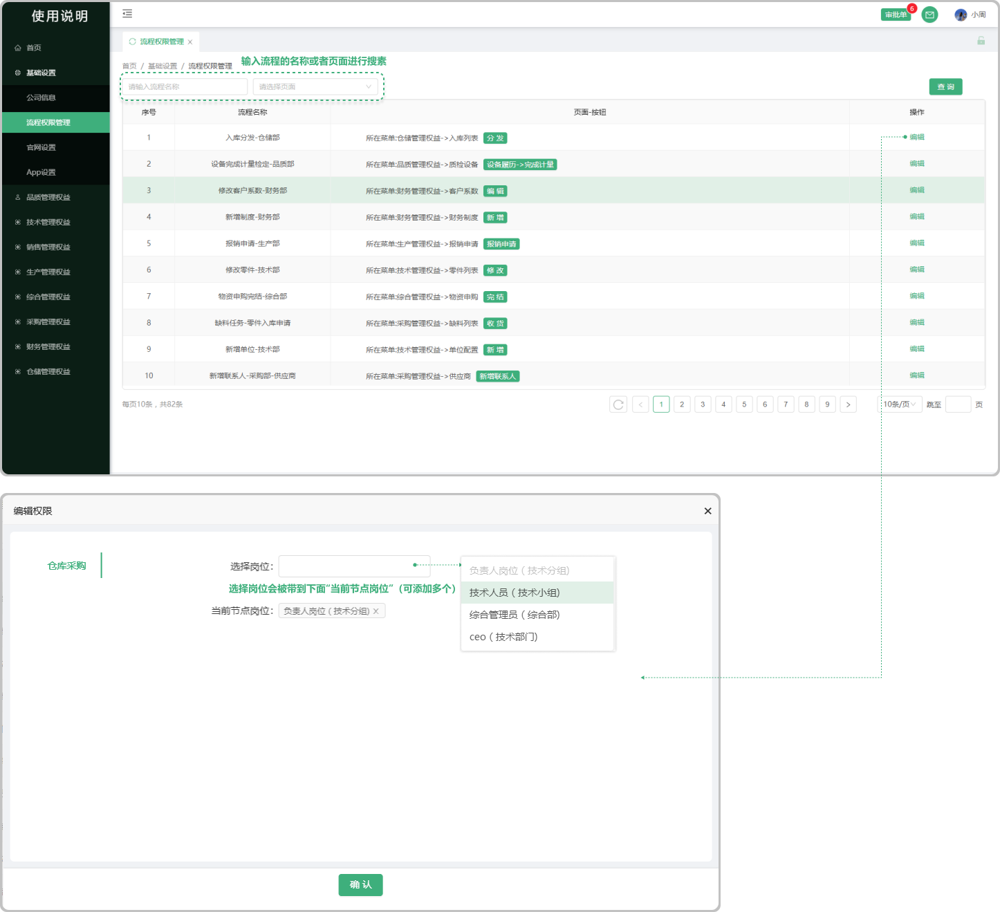

# 流程权限管理

> 系统内的流程权限管理是一种关键的安全机制，它确保了用户只能访问和操作其被授权的系统资源和功能。
* 定义：流程权限管理是指根据系统设置的安全规则或策略，对用户访问和操作特定系统流程进行限制和控制的过程。
*  目的：确保用户只能访问和操作其被授权的流程，保护系统数据的安全性和完整性，防止未经授权的访问和操作。

#### 1. 如图所示：
* 可以搜索名称或者搜素页面能够快速查找到需要分配的权限设置，权限可以进行编辑更改,这个如果用户没有这个流程的权限，就没有办法操作这个流程，就没有操作这个流程的权限,流程又分为流程节点如果是审批的节点有权限只能进行审批如果有申请权限只可以申请

