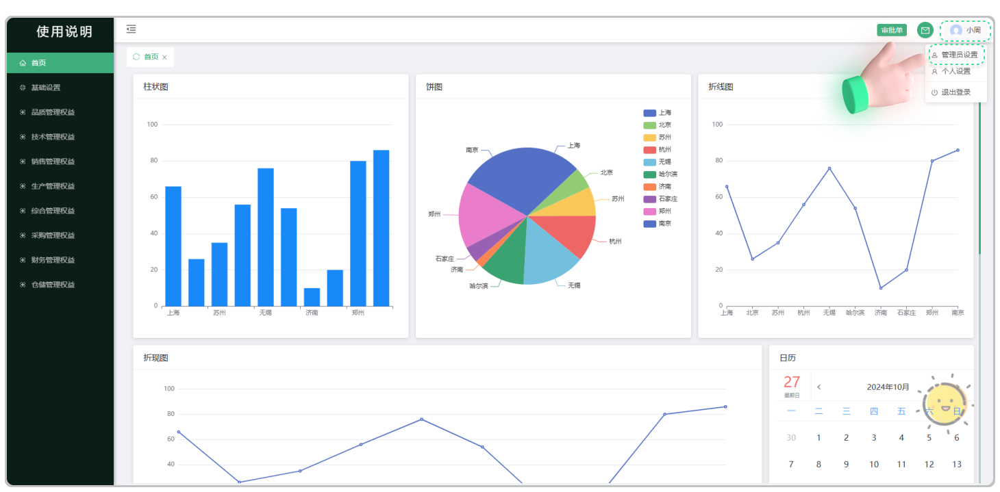
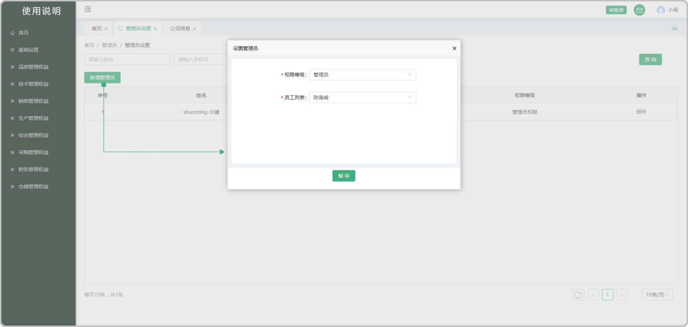
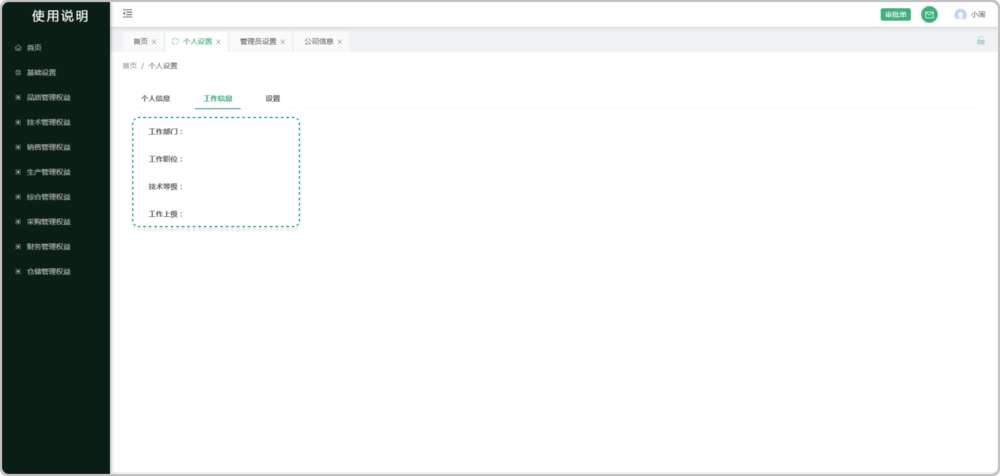
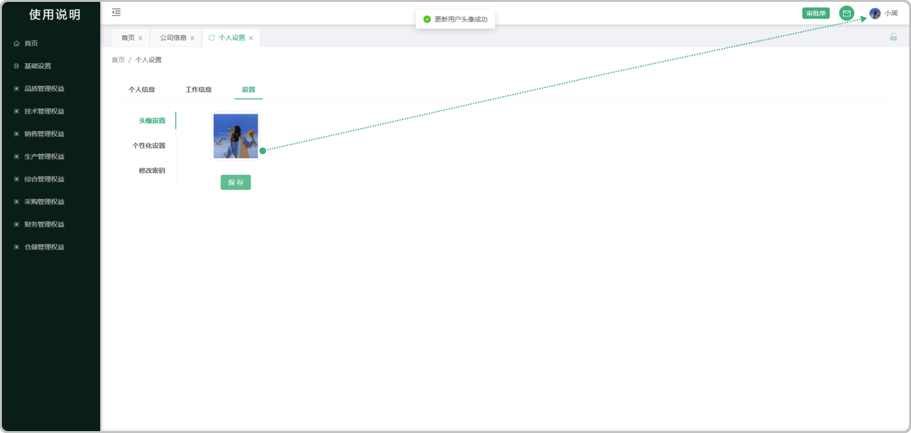
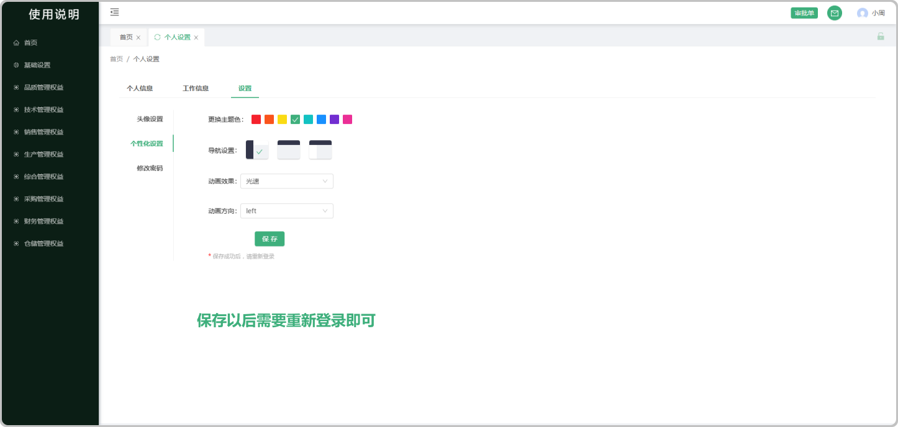
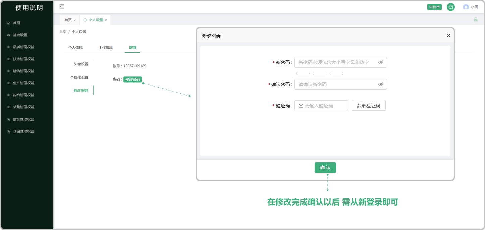
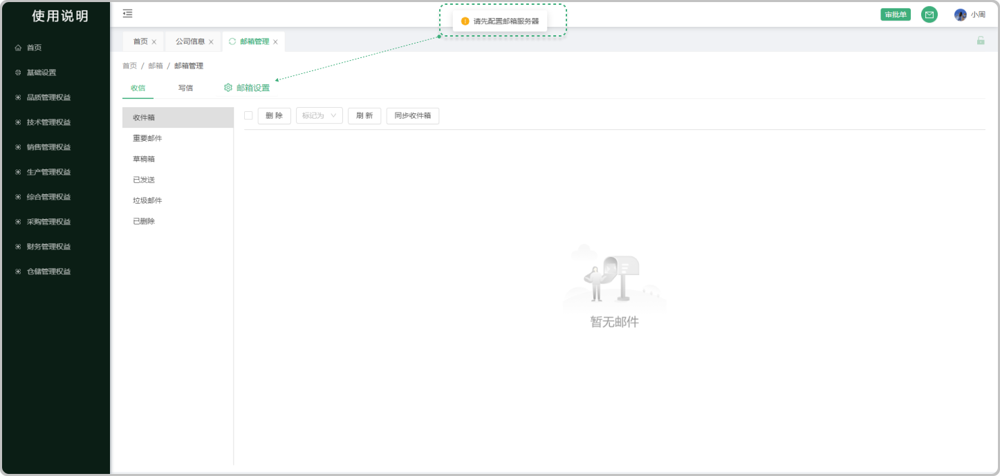
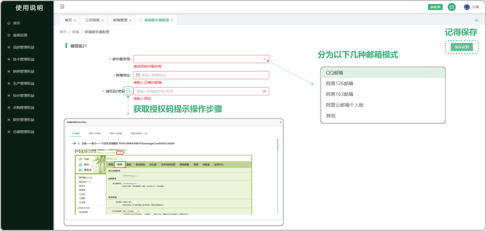

# 首页

> ###  一、登录系统页面操作流程

#### 1. 如图所示：点击系统登录页面

> ###  二、进入系统右上方第一个是个人账号设置分为《管理员设置》和《个人设置》以及《退出登录》

#### 2. 如图所示：管理员设置

 ##### 管理员分为《超级管理员》 《管理员》 《运营管理员》 可以新增《管理员》 《运营管理员》 前提是在基础设置人员信息中添加或者有人员信息的情况下新增同时支持删除

#### 3. 如图所示：新增管理员

##### 个人设置分为 《个人信息》 《工作信息》 《设置》可以查看个人的信息展示 工作的信息内容 和系统的基础设置

#### 3. 如图所示：个人信息指的是个人的姓名、手机号、邮箱

#### 4. 如图所示：工作信息指的是个人的工作部门、工作职位、技术等级、工作上级

#### 5-7.如图所示：在设置中可以更换头像、个性化的一些设置、和修改密码

**头像设置**

**个性化设置**

**修改密码**

> ###  三、邮箱管理可以添加邮箱,在系统中发送信件和及时收到对方的信件

#### 8.如图所示:当点击 收信 和 写信 时会提示请先  配置邮箱服务器  因为还为添加邮箱,所以要去邮箱设置中配置邮箱服务器

#### 9.如图所示:在邮箱服务器配置中,选择邮件服务商,输入邮箱地址,授权码/密码最后获取授权码（授权码有提示标识，可以查看到每一个邮箱获取授权码的操作流程

